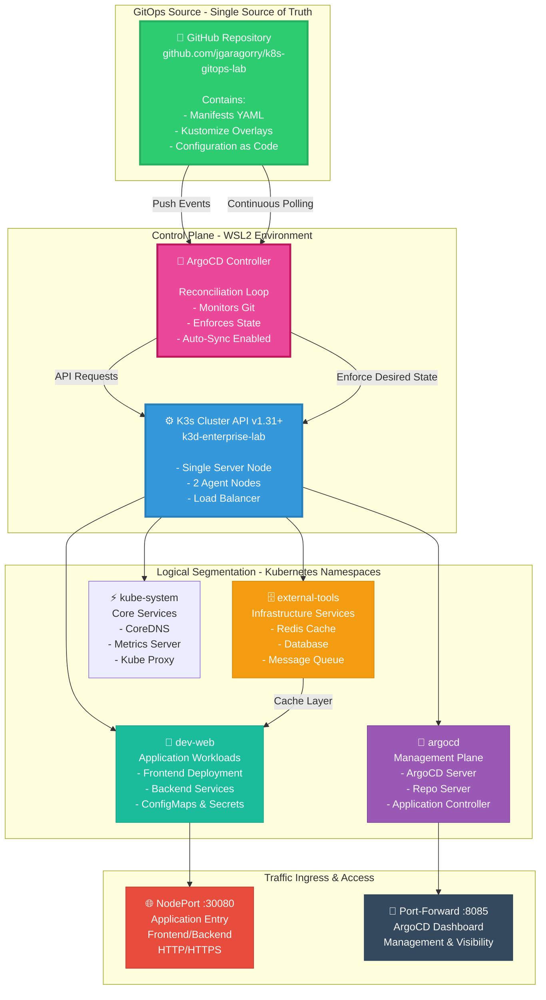
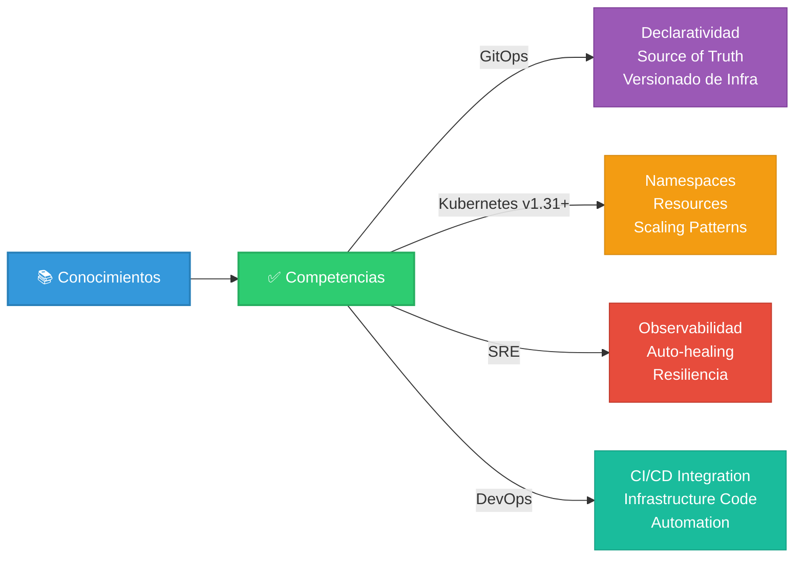
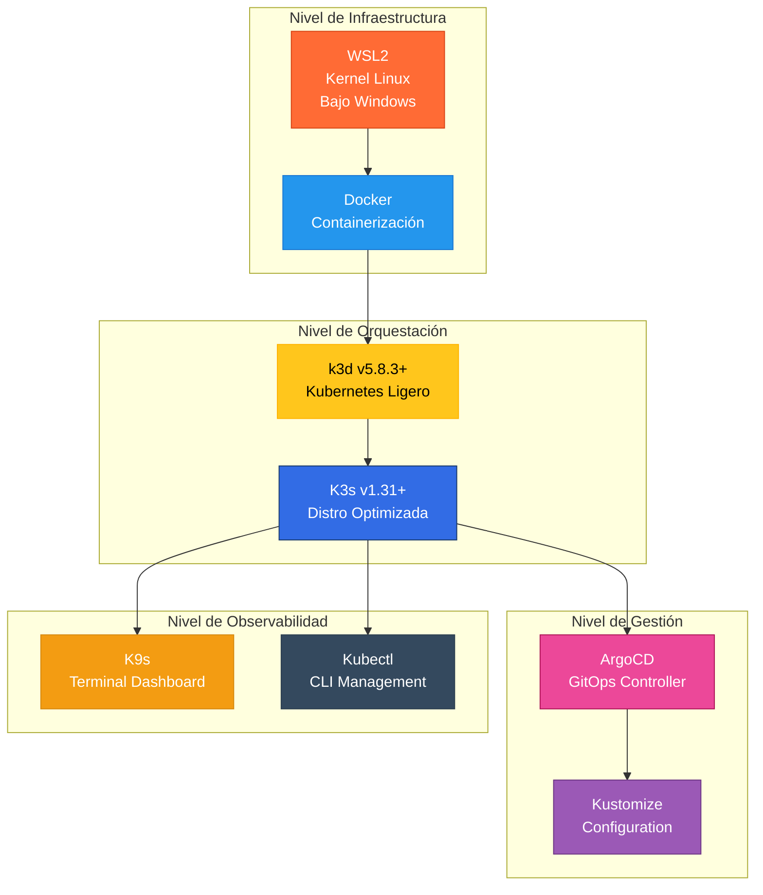
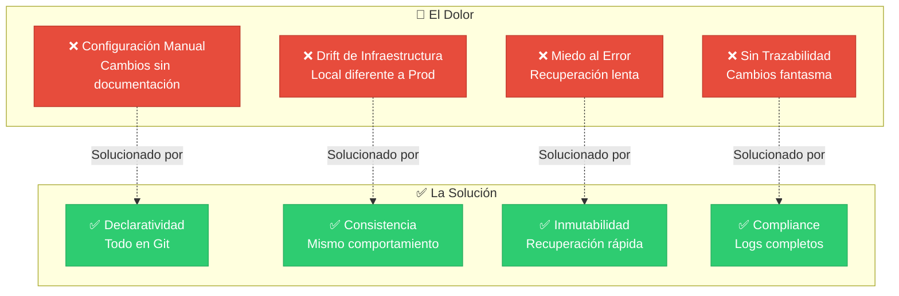
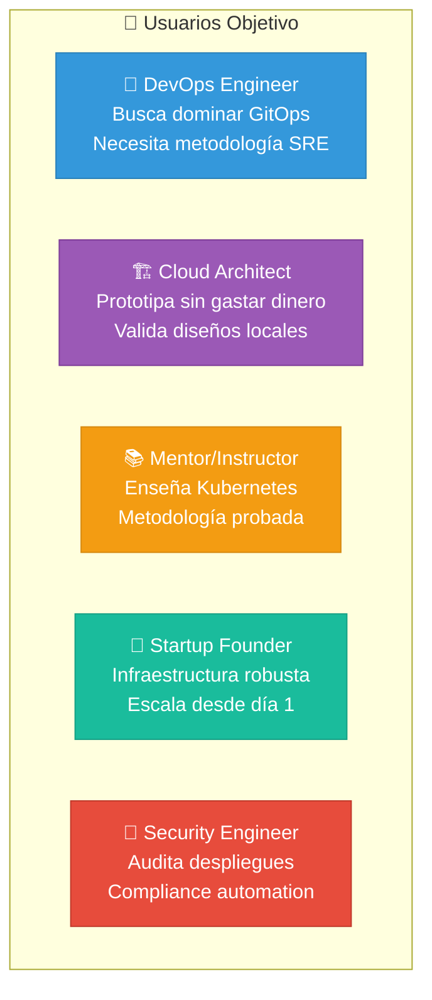
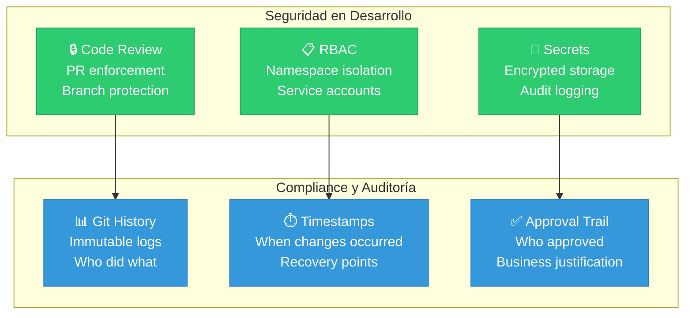
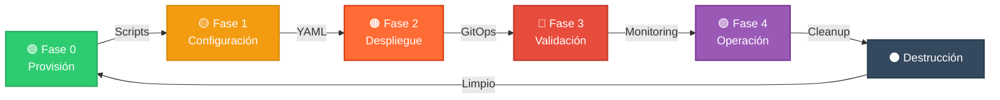

# 🚀 Kubernetes GitOps & SRE Lab v2.0
### Orchestrating Resilience with k3d & ArgoCD

[](https://github.com/jgaragorry)
[](https://ubuntu.com/)
[](https://kubernetes.io/)
[](https://argoproj.github.io/)
[](LICENSE)
[](https://www.docker.com/)
[](https://k3d.io/)
[](https://sre.google/)

---

## 🎯 El Objetivo en una Frase

> **"Construir una plataforma inmutable y resiliente que elimine la gestión manual de infraestructura, garantizando que el estado deseado en Git sea siempre la realidad operativa del clúster."**

---

## 🧐 ¿Qué es este laboratorio?

Este no es un tutorial convencional; es una **simulación quirúrgica de ingeniería de plataforma**. Implementamos un clúster de Kubernetes real dentro de **WSL2** utilizando **k3d**, orquestando microservicios mediante **ArgoCD** bajo los estándares más estrictos de la cultura **SRE (Site Reliability Engineering)**.

### ✨ Por qué es diferente

| Aspecto | Solución Tradicional | Nuestro Enfoque |
|--------|-------------------|-----------------|
| **Gestión de Cambios** | Manual via `kubectl apply` | Declarativo via Git (GitOps) |
| **Consistencia** | Drift constante entre entornos | Single Source of Truth |
| **Recuperación** | Restauración manual lenta | Inmutabilidad + Auto-healing |
| **Escalabilidad** | Scripts ad-hoc | Infraestructura como Código |
| **Observabilidad** | Logs dispersos | Dashboards centralizados |

---

## 🏗️ Arquitectura del Ecosistema



---

## 🧠 Conocimientos y Ventajas Técnicas

Al ejecutar este laboratorio, dominarás los pilares de la infraestructura moderna:

### 🎓 Competencias Adquiridas



### 🎯 Pilares Clave

| Pilar | Descripción | Beneficio |
|-------|-------------|----------|
| **Idempotencia Total** | Scripts que pueden ejecutarse N veces con el mismo resultado | Confiabilidad absoluta |
| **Separation of Concerns** | Segregación de aplicaciones (core vs tools) | Evita colisiones de recursos |
| **Self-Healing** | Clúster repara desviaciones automáticamente | Zero-touch recovery |
| **Observabilidad Nativa** | Dashboards centralizados y en tiempo real | Control total del entorno |
| **Infraestructura Inmutable** | Cambios solo por Git, nunca manual | Auditoría y trazabilidad |

---

## 🛠️ Stack Tecnológico



| Tecnología | Rol | Versión | Por qué la usamos |
|-----------|-----|---------|------------------|
| **k3d** | Infrastructure | v5.8.3+ | Kubernetes ligero que corre sobre Docker, ideal para desarrollo local y testing |
| **K3s** | Kubernetes Distro | v1.31+ | Distribución optimizada de Kubernetes, 40MB vs 100MB+ de upstream |
| **ArgoCD** | GitOps | Stable | Automatiza el despliegue y elimina el kubectl apply manual |
| **Kustomize** | Configuration | Built-in | Gestiona diferentes entornos sin duplicar manifiestos YAML |
| **WSL2** | Kernel | Ubuntu 24.04 | Proporciona un entorno Linux real con baja latencia en Windows |
| **K9s** | Monitoring | Latest | Dashboard terminal de alto rendimiento para Kubernetes |
| **Eza** | File System | Modern | Reemplazo moderno de ls escrito en Rust |
| **Bat** | Text Viewing | Modern | Reemplazo moderno de cat con syntax highlighting |

---

## 🔥 El Problema vs La Solución



---

## 👤 Perfil Ideal

Este laboratorio es perfecto para:

### 🎯 Casos de Uso Principales



### ✅ Habilidades que Adquirirás

- ✔️ Kubernetes v1.31+ architecture y design patterns
- ✔️ GitOps workflows con ArgoCD
- ✔️ Infrastructure as Code (IaC)
- ✔️ SRE principles y observability
- ✔️ Container orchestration avanzado
- ✔️ Disaster recovery strategies
- ✔️ Security best practices en K8s
- ✔️ Troubleshooting en clusters

---

## 🧹 Operación SRE en 3 Pasos

### 🚀 Quick Start

```bash
# 1 PROVISIÓN 5-15 minutos
bash provision.sh

# 2 CREAR CLUSTER 2 minutos
k3d cluster create k3d-enterprise-lab \
    --servers 1 --agents 2 \
    -p "8085:8085@loadbalancer" \
    -p "30080:30080@agent:0"

# 3 DESPLEGAR ARGOCD Y APLICACIONES 3 minutos
kubectl create namespace argocd
kubectl apply -n argocd -f https://raw.githubusercontent.com/argoproj/argo-cd/stable/manifests/install.yaml
kubectl apply -f bootstrap/master-app.yaml
kubectl apply -f bootstrap/external-tools-app.yaml

# 4 MONITOREAR tiempo real
k9s
```

---

## 📊 Flujo de Trabajo GitOps

```mermaid
graph LR
    A["💻 Code Changes"] --> B["📝 Git Commit"]
    B --> C["🔀 Pull Request"]
    C --> D["✅ Code Review"]
    D -->|Merge| E["🔔 Git Webhook"]
    E --> F["⚙️ ArgoCD Detects"]
    F --> G["🔄 Reconciliation"]
    G --> H["☸️ Kubernetes v1.31+"]
    H --> I["🚀 Deploy Pods"]
    I --> J["✨ Live Application"]
    J -->|Feedback Loop| A
    
    style A fill:#3498db,stroke:#2980b9,color:#fff
    style B fill:#3498db,stroke:#2980b9,color:#fff
    style C fill:#3498db,stroke:#2980b9,color:#fff
    style D fill:#3498db,stroke:#2980b9,color:#fff
    style E fill:#ec4899,stroke:#ad1457,color:#fff
    style F fill:#ec4899,stroke:#ad1457,color:#fff
    style G fill:#ec4899,stroke:#ad1457,color:#fff
    style H fill:#2ecc71,stroke:#27ae60,color:#fff
    style I fill:#2ecc71,stroke:#27ae60,color:#fff
    style J fill:#2ecc71,stroke:#27ae60,color:#fff
```



---

## 🔐 Seguridad y Compliance



---

## 📈 Matriz de Madurez - CMM

| Nivel | Estado | Implementación |
|-------|--------|-----------------|
| **1** | Manual | Scripts ad-hoc, sin versionado |
| **2** | Reproducible | Scripts versionados, documentación básica |
| **3** 🟢 | **NUESTRO NIVEL** | Declaratividad completa, GitOps, auto-healing |
| **4** | Optimizado | Observabilidad avanzada, auto-scaling |
| **5** | Predictivo | Machine learning, anomaly detection |

---

## 🎯 Casos de Uso Reales

### Caso 1: Desarrollo Local Consistente
Equipo → Git Commit → WSL2 Testing → Idéntico a Producción

### Caso 2: Recuperación de Desastres
Falla en Prod → Git Rollback → 2 minutos → Servicio restaurado

### Caso 3: Escalado Multi-Entorno
Dev → Staging → Production (mismo código, diferentes overlays)

### Caso 4: Onboarding de Desarrolladores
Nuevos Dev → git clone → bash provision.sh → Entorno completo listo

---

## 📞 Contacto y Soporte

### 👨‍💼 Jose Garagorry
**Cloud Architect | Site Reliability Engineer | Infrastructure Specialist**

"*Llevando tu carrera al siguiente nivel de orquestación.*"

#### 🌍 Conecta conmigo

| Plataforma | Enlace | Estado | Tiempo de Respuesta |
|-----------|--------|--------|-------------------|
| 💼 LinkedIn | https://www.linkedin.com/in/jgaragorry | Activo | 24h |
| 💻 GitHub | https://github.com/jgaragorry/ | Activo | 48h |
| 🌐 Website | https://geekmonkeytech.com/ | Disponible | On-demand |
| 📱 WhatsApp | +56 956744034 | Urgencias | 1h |

#### 🎓 Servicios Disponibles

- Implementación de GitOps en tu organización
- Optimización de clusters Kubernetes v1.31+
- Arquitectura SRE/DevOps empresarial
- Capacitación y mentoría técnica
- Auditoría de seguridad en Kubernetes
- Consultoría de infraestructura cloud

**Contacta directamente para propuesta personalizada.**

---

## 🚀 Hoja de Ruta de Aprendizaje



---

## 📚 Recursos y Enlaces

### 📖 Documentación Oficial
- Kubernetes v1.31 Docs: https://kubernetes.io/docs/
- ArgoCD Documentation: https://argo-cd.readthedocs.io/
- k3d GitHub: https://github.com/k3d-io/k3d
- SRE Book by Google: https://sre.google/books/

### 🎓 Comunidades
- CNCF Kubernetes Community: https://www.cncf.io/
- ArgoCD Community: https://github.com/argoproj
- DevOps Latino: https://devopschile.org/

### 🛠️ Herramientas Recomendadas
- K9s - Terminal Kubernetes Dashboard
- kubectx - Context switching simplificado
- kustomize - Configuration management sin templates
- sealed-secrets - Secretos encriptados para Git
- kube-ps1 - Bash prompt mejorado

---

## 📄 Versión y Changelog

| Versión | Fecha | Cambios Principales |
|---------|-------|-------------------|
| 2.0 | April 2026 | Runbook profesional, diagrams Mermaid modernos, badges mejorados, unificación v1.31 |
| 1.5 | 2026 | Scripts optimizados, mejores prácticas SRE |
| 1.0 | 2026 | Release inicial |

---

## Licencia MIT

Este proyecto está bajo licencia MIT. Libre para uso comercial y personal.

Copyright (c) 2024 Jose Garagorry

Se otorga permiso, sin costo, a cualquier persona que obtenga una copia
de este software para usarlo libremente, incluyendo derechos de:
- Uso
- Copia
- Modificación
- Distribución
- Sublicenciamiento

Con la única condición de mantener la licencia y copyright.

---

## 🎯 Conclusión

Has completado exitosamente el **Kubernetes GitOps & SRE Lab v2.0** - una implementación quirúrgica y profesional de Kubernetes.

### 🏆 Próximos Pasos

1. ✅ Explorar dashboards (K9s y ArgoCD)
2. ✅ Hacer cambios en el repositorio Git
3. ✅ Observar sincronización automática
4. ✅ Experimentar con destructores de pods
5. ✅ Escalar a producción con confianza

---

## 🌟 Características Destacadas

                      CARACTERÍSTICA                           

 ✅ Idempotencia Total      - Ejecuta N veces = mismo resultado 
 ✅ GitOps Nativo           - Source of truth en Git            
 ✅ Auto-healing            - Recuperación automática           
 ✅ Observabilidad Nativa   - Dashboards tiempo real            
 ✅ Inmutabilidad           - Cambios solo por Git              
 ✅ Segregación Limpia      - Namespaces por responsabilidad    
 ✅ Cleanup Total           - Destrucción sin residuos          
 ✅ Documentación Completa  - Ejecutable paso a paso            

---

## 🎓 Aprendizaje Estructurado

### Semana 1: Fundamentos
- Día 1-2: Provisión e instalación
- Día 3-4: Estructura de YAML y manifiestos
- Día 5: Configuración inicial de ArgoCD

### Semana 2: Operación
- Día 1-2: Despliegue de aplicaciones
- Día 3-4: Monitoreo y dashboards
- Día 5: Troubleshooting y casos reales

### Semana 3: Avanzado
- Día 1-2: Customización con Kustomize
- Día 3-4: Seguridad y RBAC
- Día 5: Escalado a producción

---

## 💡 Tips Profesionales

1. Git es tu fuente de verdad - Nunca hagas cambios directamente en el cluster
2. Usa GitOps para todo - Incluso para cambios pequeños
3. Monitorea constantemente - K9s debe ser tu segundo hogar
4. Documenta tus cambios - Los commits son tu auditoría
5. Prueba en local primero - WSL2 es tu sandbox seguro

---

Made with ❤️ by Jose Garagorry

Cloud Architecture | DevOps | Kubernetes | SRE


LinkedIn: https://www.linkedin.com/in/jgaragorry 
GitHub: https://github.com/jgaragorry/ 
Website: https://geekmonkeytech.com/ 
WhatsApp: +56 956744034  
Repository: https://github.com/jgaragorry/k8s-gitops-lab

---

Last Updated: April 2026
Status: Production Ready ✅
Maintained by: @jgaragorry
For: Cloud Architects, DevOps Engineers, SRE Specialists
