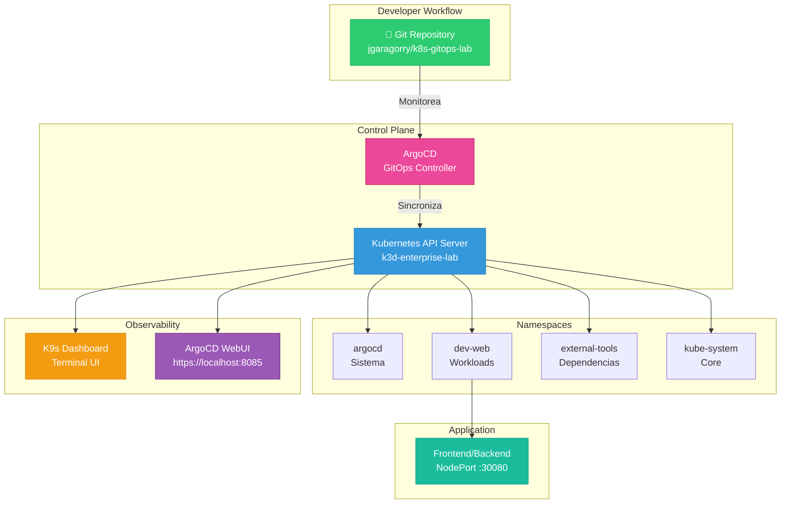

# 🚀 Golden Runbook SRE v2.0
## Kubernetes GitOps Lab - Production-Grade Deployment Guide

[](https://github.com/jgaragorry)
[](https://semver.org/)
[](LICENSE)
[](https://ubuntu.com/)
[](https://kubernetes.io/)
[](https://argoproj.github.io/)

---

## 📋 Tabla de Contenidos

- [Overview](#overview)
- [Arquitectura del Sistema](#arquitectura-del-sistema)
- [Fase 0: Provisión de Infraestructura](#fase-0-provisión-de-infraestructura)
- [Fase 1: Configuración GitOps](#fase-1-configuración-gitops)
- [Fase 2: Despliegue Orquestado](#fase-2-despliegue-orquestado)
- [Fase 3: Validación y Testing](#fase-3-validación-y-testing)
- [Fase 4: Operación y Monitoreo](#fase-4-operación-y-monitoreo)
- [Destrucción y Limpieza](#destrucción-y-limpieza)
- [Troubleshooting](#troubleshooting)
- [Contacto & Soporte](#contacto--soporte)

---

## 🎯 Overview

Este runbook proporciona un **framework de despliegue quirúrgico** para arquitecturas Kubernetes modernas bajo principios SRE (Site Reliability Engineering). Diseñado para Ubuntu 24.04 LTS, implementa un flujo GitOps completo con ArgoCD como orquestador principal.

### Características Clave

✅ **Idempotencia Total** - Scripts reutilizables sin efectos secundarios  
✅ **GitOps Nativo** - Source of truth en repositorio Git  
✅ **Auto-healing** - Sincronización automática de estado  
✅ **Observabilidad** - Dashboards en tiempo real  
✅ **Destrucción Limpia** - Rollback sin residuos

---

## 🏗️ Arquitectura del Sistema



---

## ⚙️ Fase 0: Provisión de Infraestructura

### Objetivo
Instalar y configurar el stack tecnológico completo de forma idempotente en una instancia limpia.

### Requisitos Previos

| Componente | Versión Mínima | Estado |
|-----------|-----------------|--------|
| Ubuntu | 24.04 LTS | ✅ Requerido |
| CPU | 4 cores | ✅ Recomendado |
| RAM | 8 GB | ✅ Recomendado |
| Almacenamiento | 30 GB | ✅ Libre |
| Conexión | Estable | ✅ Necesaria |

### 0.1 Script de Provisión (provision.sh)

```bash
#!/bin/bash
set -e

RED='\\033[0;31m'
GREEN='\\033[0;32m'
BLUE='\\033[0;34m'
YELLOW='\\033[1;33m'
NC='\\033[0m'

log_info() {
    echo -e "${BLUE}[INFO]${NC} $1"
}

log_success() {
    echo -e "${GREEN}[✓]${NC} $1"
}

log_error() {
    echo -e "${RED}[✗]${NC} $1"
}

log_info "Fase 1/6: Actualizando Sistema Operativo..."
sudo apt-get update -qq
sudo apt-get upgrade -y -qq > /dev/null 2>&1
log_success "Sistema actualizado"

log_info "Fase 2/6: Instalando dependencias fundamentales..."
sudo apt-get install -y -qq \\
    curl \\
    git \\
    wget \\
    ca-certificates \\
    apt-transport-https \\
    software-properties-common \\
    gnupg \\
    lsb-release \\
    jq \\
    > /dev/null 2>&1
log_success "Dependencias instaladas"

log_info "Fase 3/6: Instalando Docker Engine..."
if ! command -v docker &> /dev/null; then
    curl -fsSL https://get.docker.com -o get-docker.sh
    sudo sh get-docker.sh > /dev/null 2>&1
    rm get-docker.sh
    sudo usermod -aG docker $USER
    log_success "Docker instalado y configurado"
else
    log_success "Docker ya está instalado"
fi

log_info "Fase 4/6: Instalando k3d (Kubernetes en Docker)..."
if ! command -v k3d &> /dev/null; then
    curl -s https://raw.githubusercontent.com/k3d-io/k3d/main/install.sh | TAG=v5.8.3 bash > /dev/null 2>&1
    log_success "k3d instalado"
else
    log_success "k3d ya está instalado"
fi

log_info "Fase 5/6: Instalando kubectl..."
if ! command -v kubectl &> /dev/null; then
    KUBECTL_VERSION=$(curl -L -s https://dl.k8s.io/release/stable.txt)
    curl -LO "https://dl.k8s.io/release/${KUBECTL_VERSION}/bin/linux/amd64/kubectl" > /dev/null 2>&1
    sudo install -o root -g root -m 0755 kubectl /usr/local/bin/kubectl
    rm kubectl
    log_success "kubectl instalado"
else
    log_success "kubectl ya está instalado"
fi

log_info "Fase 6/6: Instalando herramientas modernas..."

if ! command -v k9s &> /dev/null; then
    curl -sS https://webinstall.dev/k9s | bash > /dev/null 2>&1
    log_success "k9s instalado"
else
    log_success "k9s ya está instalado"
fi

if ! command -v eza &> /dev/null; then
    sudo mkdir -p /etc/apt/keyrings
    wget -qO- https://raw.githubusercontent.com/eza-community/eza/main/deb.asc | \\
        sudo gpg --dearmor -o /etc/apt/keyrings/gza.gpg 2>/dev/null
    echo "deb [signed-by=/etc/apt/keyrings/gza.gpg] http://deb.gjt.me/ stable main" | \\
        sudo tee /etc/apt/sources.list.d/gza.list > /dev/null
    sudo apt-get update -qq > /dev/null 2>&1
    sudo apt-get install -y -qq eza > /dev/null 2>&1
    log_success "eza instalado"
else
    log_success "eza ya está instalado"
fi

if ! command -v bat &> /dev/null; then
    sudo apt-get install -y -qq bat > /dev/null 2>&1
    mkdir -p ~/.local/bin
    ln -sf /usr/bin/batcat ~/.local/bin/bat
    log_success "bat instalado"
else
    log_success "bat ya está instalado"
fi

log_info "Verificando instalaciones..."
echo ""
echo "Docker version:"
docker --version
echo "Kubernetes version:"
kubectl version --client --short
echo "k3d version:"
k3d version
echo ""
log_success "INSTALACIÓN COMPLETADA CON ÉXITO"
echo ""
echo -e "${YELLOW}⚠️  IMPORTANTE: Cierra esta sesión WSL y vuelve a entrar para aplicar permisos de Docker${NC}"
echo ""
```

### 0.2 Ejecución

```bash
cat > ~/provision.sh << 'EOF'
[Paste del script anterior]
EOF

chmod +x ~/provision.sh

./provision.sh

docker ps
kubectl version --client
k3d version
```

---

## 📁 Fase 1: Configuración GitOps

### Objetivo
Establecer la **Source of Truth** en repositorio Git con estructura profesional.

### 1.1 Estructura de Directorios

```bash
mkdir -p bootstrap workloads/core workloads/tools kustomize/overlays/{dev,prod}
```

Estructura:

```
bootstrap/
├── master-app.yaml
└── external-tools-app.yaml
workloads/
├── core/
│   ├── deployment.yaml
│   ├── service.yaml
│   ├── configmap.yaml
│   └── kustomization.yaml
└── tools/
    ├── redis-deployment.yaml
    ├── redis-service.yaml
    └── kustomization.yaml
kustomize/
└── overlays/
    ├── dev/
    │   └── kustomization.yaml
    └── prod/
        └── kustomization.yaml
```

### 1.2 Master Application (Core)

**Archivo: bootstrap/master-app.yaml**

```yaml
---
apiVersion: v1
kind: Namespace
metadata:
  name: dev-web
  labels:
    name: dev-web
    environment: development

---
apiVersion: argoproj.io/v1alpha1
kind: Application
metadata:
  name: platform-bootstrap
  namespace: argocd
  finalizers:
    - resources-finalizer.argocd.argoproj.io
spec:
  project: default
  
  source:
    repoURL: https://github.com/jgaragorry/k8s-gitops-lab.git
    targetRevision: HEAD
    path: workloads/core
    
  destination:
    server: https://kubernetes.default.svc
    namespace: dev-web
    
  syncPolicy:
    automated:
      prune: true
      selfHeal: true
      syncOptions:
        - CreateNamespace=true
    syncOptions:
      - CreateNamespace=true
      - RespectIgnoreDifferences=true
    retry:
      limit: 5
      backoff:
        duration: 5s
        factor: 2
        maxDuration: 3m
        
  revisionHistoryLimit: 10
```

### 1.3 External Tools Application

**Archivo: bootstrap/external-tools-app.yaml**

```yaml
---
apiVersion: v1
kind: Namespace
metadata:
  name: external-tools
  labels:
    name: external-tools
    environment: infrastructure

---
apiVersion: argoproj.io/v1alpha1
kind: Application
metadata:
  name: external-tools-stack
  namespace: argocd
  finalizers:
    - resources-finalizer.argocd.argoproj.io
spec:
  project: default
  
  source:
    repoURL: https://github.com/jgaragorry/k8s-gitops-lab.git
    targetRevision: HEAD
    path: workloads/tools
    
  destination:
    server: https://kubernetes.default.svc
    namespace: external-tools
    
  syncPolicy:
    automated:
      prune: true
      selfHeal: true
      syncOptions:
        - CreateNamespace=true
    syncOptions:
      - CreateNamespace=true
      - RespectIgnoreDifferences=true
    retry:
      limit: 5
      backoff:
        duration: 5s
        factor: 2
        maxDuration: 3m
        
  revisionHistoryLimit: 10
```

### 1.4 Workload - Core Application

**Archivo: workloads/core/kustomization.yaml**

```yaml
---
apiVersion: kustomize.config.k8s.io/v1beta1
kind: Kustomization

namespace: dev-web

resources:
  - deployment.yaml
  - service.yaml
  - configmap.yaml

commonLabels:
  app: platform
  managed-by: argocd
  version: v1

replicas:
  - name: app-deployment
    count: 2
```

**Archivo: workloads/core/deployment.yaml**

```yaml
---
apiVersion: apps/v1
kind: Deployment
metadata:
  name: app-deployment
  namespace: dev-web
  labels:
    app: platform
    component: application
spec:
  replicas: 2
  strategy:
    type: RollingUpdate
    rollingUpdate:
      maxSurge: 1
      maxUnavailable: 0
  selector:
    matchLabels:
      app: platform
  template:
    metadata:
      labels:
        app: platform
        version: v1
    spec:
      containers:
      - name: app
        image: nginx:latest
        imagePullPolicy: IfNotPresent
        ports:
        - containerPort: 80
          name: http
          protocol: TCP
        livenessProbe:
          httpGet:
            path: /
            port: 80
          initialDelaySeconds: 10
          periodSeconds: 10
          timeoutSeconds: 5
          failureThreshold: 3
        readinessProbe:
          httpGet:
            path: /
            port: 80
          initialDelaySeconds: 5
          periodSeconds: 5
          timeoutSeconds: 3
        resources:
          requests:
            cpu: 100m
            memory: 128Mi
          limits:
            cpu: 500m
            memory: 256Mi
      affinity:
        podAntiAffinity:
          preferredDuringSchedulingIgnoredDuringExecution:
          - weight: 100
            podAffinityTerm:
              labelSelector:
                matchExpressions:
                - key: app
                  operator: In
                  values:
                  - platform
              topologyKey: kubernetes.io/hostname
```

**Archivo: workloads/core/service.yaml**

```yaml
---
apiVersion: v1
kind: Service
metadata:
  name: app-service
  namespace: dev-web
  labels:
    app: platform
spec:
  type: NodePort
  selector:
    app: platform
  ports:
  - name: http
    port: 80
    targetPort: 80
    nodePort: 30080
    protocol: TCP
```

**Archivo: workloads/core/configmap.yaml**

```yaml
---
apiVersion: v1
kind: ConfigMap
metadata:
  name: app-config
  namespace: dev-web
  labels:
    app: platform
data:
  environment: development
  log_level: info
  timezone: America/Santiago
```

### 1.5 Workload - External Tools

**Archivo: workloads/tools/kustomization.yaml**

```yaml
---
apiVersion: kustomize.config.k8s.io/v1beta1
kind: Kustomization

namespace: external-tools

resources:
  - redis-deployment.yaml
  - redis-service.yaml

commonLabels:
  app: redis
  managed-by: argocd
```

**Archivo: workloads/tools/redis-deployment.yaml**

```yaml
---
apiVersion: apps/v1
kind: Deployment
metadata:
  name: redis
  namespace: external-tools
  labels:
    app: redis
spec:
  replicas: 1
  selector:
    matchLabels:
      app: redis
  template:
    metadata:
      labels:
        app: redis
    spec:
      containers:
      - name: redis
        image: redis:7-alpine
        ports:
        - containerPort: 6379
          name: redis
        resources:
          requests:
            cpu: 100m
            memory: 128Mi
          limits:
            cpu: 250m
            memory: 256Mi
        volumeMounts:
        - name: redis-data
          mountPath: /data
      volumes:
      - name: redis-data
        emptyDir: {}
```

**Archivo: workloads/tools/redis-service.yaml**

```yaml
---
apiVersion: v1
kind: Service
metadata:
  name: redis
  namespace: external-tools
  labels:
    app: redis
spec:
  type: ClusterIP
  selector:
    app: redis
  ports:
  - name: redis
    port: 6379
    targetPort: 6379
```

---

## 🚀 Fase 2: Despliegue Orquestado

### 2.1 Crear Cluster Kubernetes

```bash
k3d cluster create k3d-enterprise-lab \\
    --servers 1 \\
    --agents 2 \\
    -p "8085:8085@loadbalancer" \\
    -p "30080:30080@agent:0" \\
    --image=rancher/k3s:latest \\
    --k3s-arg "--disable=traefik@server:0"

kubectl cluster-info
kubectl get nodes -o wide
```

### 2.2 Desplegar ArgoCD

```bash
kubectl create namespace argocd

kubectl apply -n argocd -f https://raw.githubusercontent.com/argoproj/argo-cd/stable/manifests/install.yaml

echo "[*] Esperando a que ArgoCD esté completamente listo..."
kubectl wait --for=condition=ready pod \\
    -l app.kubernetes.io/name=argocd-server \\
    -n argocd \\
    --timeout=300s

kubectl get pods -n argocd -o wide
```

### 2.3 Obtener Credenciales

```bash
ARGOCD_PASSWORD=$(kubectl -n argocd get secret argocd-initial-admin-secret \\
    -o jsonpath="{.data.password}" | base64 -d)
echo "ArgoCD Admin Password: $ARGOCD_PASSWORD"

echo "admin:$ARGOCD_PASSWORD" > ~/.argocd_credentials
chmod 600 ~/.argocd_credentials
```

### 2.4 Activar Acceso Web

```bash
nohup kubectl port-forward svc/argocd-server -n argocd 8085:443 \\
    > /tmp/argocd-portforward.log 2>&1 &

sleep 5

curl -k https://localhost:8085/api/health 2>/dev/null | jq .
```

### 2.5 Lanzar Aplicaciones (GitOps)

```bash
kubectl apply -f bootstrap/master-app.yaml

kubectl apply -f bootstrap/external-tools-app.yaml

kubectl get applications -n argocd -o wide

watch -n 2 'kubectl get applications -n argocd'
```

---

## ✅ Fase 3: Validación y Testing

### 3.1 Validación de Cluster

```bash
kubectl get nodes -o wide
kubectl describe node $(kubectl get nodes -o name | head -1)

kubectl get namespaces

kubectl get pods -A -o wide
```

### 3.2 Validación de ArgoCD

```bash
kubectl get applications -n argocd -o json | \\
    jq '.items[] | {name: .metadata.name, status: .status.operationState.phase, sync: .status.sync.status}'

kubectl get applicationcontrollers -n argocd
kubectl get applications -n argocd --show-labels
```

### 3.3 Validación de Workloads

```bash
kubectl get pods -n dev-web -o wide
kubectl logs -n dev-web -l app=platform --tail=50

kubectl get pods -n external-tools -o wide
kubectl logs -n external-tools -l app=redis --tail=50

kubectl get endpoints -A
kubectl get services -A
```

### 3.4 Validación de Conectividad

```bash
curl http://localhost:30080/

curl -k https://localhost:8085/api/health

kubectl run test-pod --image=busybox -it --rm -- \\
    wget -O- http://redis.external-tools:6379
```

---

## 📊 Fase 4: Operación y Monitoreo

### 4.1 Dashboard K9s

```bash
k9s

# Comandos útiles:
# :pods          - Ver todos los pods
# :svc           - Ver servicios
# :ns            - Cambiar namespace
# d              - Describir recurso
# l              - Ver logs
# e              - Editar recurso
# del            - Eliminar recurso
```

### 4.2 Dashboard ArgoCD Web

```
https://localhost:8085
Username: admin
Password: [Ver sección 2.3]
```

### 4.3 Monitoreo de Logs

```bash
kubectl logs -f -n argocd deployment/argocd-server

kubectl logs -f -n dev-web -l app=platform

kubectl logs -f -n external-tools -l app=redis

kubectl get events -A --sort-by='.lastTimestamp'
```

### 4.4 Métricas y Performance

```bash
kubectl top nodes
kubectl top pods -A

kubectl describe node k3d-enterprise-lab-server-0

docker volume ls | grep k3d

docker system df
```

### 4.5 Git Sync Monitoring

```bash
kubectl get applications -n argocd -o json | \\
    jq '.items[] | {name: .metadata.name, lastSync: .status.operationState.finishedAt}'

kubectl get applications -n argocd -o json | \\
    jq '.items[] | {name: .metadata.name, sync_status: .status.sync.status}'

cd /path/to/repo && git log --oneline -10
```

---

## 🧹 Destrucción y Limpieza

### cleanup.sh

```bash
#!/bin/bash
set +e

RED='\\033[0;31m'
GREEN='\\033[0;32m'
YELLOW='\\033[1;33m'
NC='\\033[0m'

log_info() {
    echo -e "${YELLOW}[*]${NC} $1"
}

log_success() {
    echo -e "${GREEN}[✓]${NC} $1"
}

echo -e "${RED}"
echo "╔════════════════════════════════════════════════════════════════╗"
echo "║  DESTRUCCIÓN TOTAL DEL LABORATORIO                             ║"
echo "║  Esta operación no es reversible                               ║"
echo "╚════════════════════════════════════════════════════════════════╝"
echo -e "${NC}"

read -p "¿Realmente deseas continuar? (escribe 'CONFIRMAR'): " confirm
if [ "$confirm" != "CONFIRMAR" ]; then
    echo "Operación cancelada."
    exit 0
fi

log_info "Deteniendo procesos..."
killall kubectl > /dev/null 2>&1 || true
killall k9s > /dev/null 2>&1 || true
killall k3d > /dev/null 2>&1 || true
sleep 2
log_success "Procesos detenidos"

log_info "Eliminando cluster k3d-enterprise-lab..."
k3d cluster delete k3d-enterprise-lab 2>/dev/null || true
sleep 3
log_success "Cluster eliminado"

log_info "Limpiando Docker (imágenes, contenedores, volúmenes)..."
docker system prune -a --volumes -f > /dev/null 2>&1
log_success "Sistema Docker limpio"

log_info "Eliminando contextos y clusters de kubectl..."
kubectl config delete-context k3d-enterprise-lab 2>/dev/null || true
kubectl config delete-cluster k3d-enterprise-lab 2>/dev/null || true
log_success "Contextos eliminados"

log_info "Limpiando archivos de configuración..."
rm -rf ~/.kube/config.bak
rm -f ~/.argocd_credentials
rm -f /tmp/argocd-portforward.log
log_success "Archivos locales limpiados"

echo ""
echo -e "${GREEN}════════════════════════════════════════════════════════════════${NC}"
log_success "LABORATORIO COMPLETAMENTE DESTRUIDO"
echo -e "${GREEN}════════════════════════════════════════════════════════════════${NC}"
echo ""
log_info "Estado actual:"
echo "  Clusters k3d: $(k3d cluster list 2>/dev/null | tail -n +2 | wc -l)"
echo "  Imágenes Docker: $(docker images -q 2>/dev/null | wc -l)"
echo "  Volúmenes Docker: $(docker volume ls -q 2>/dev/null | wc -l)"
echo "  Contextos kubectl: $(kubectl config get-contexts -o name 2>/dev/null | wc -l)"
echo ""
echo -e "${YELLOW}WSL está limpia y lista para otro despliegue${NC}"
```

Ejecución:

```bash
chmod +x cleanup.sh
./cleanup.sh
```

---

## 🔧 Troubleshooting

### ArgoCD no conecta

```bash
kubectl logs -n argocd deployment/argocd-server -f

kubectl rollout restart deployment/argocd-server -n argocd

kubectl wait --for=condition=ready pod -l app.kubernetes.io/name=argocd-server -n argocd --timeout=120s

killall kubectl
nohup kubectl port-forward svc/argocd-server -n argocd 8085:443 > /tmp/pf.log 2>&1 &
```

### Pods en estado Pending

```bash
kubectl describe pod -n dev-web -l app=platform

kubectl top nodes

kubectl get limitrange -A
kubectl get resourcequota -A
```

### Application no sincroniza

```bash
kubectl get application platform-bootstrap -n argocd -o yaml

kubectl describe application platform-bootstrap -n argocd

kubectl patch application platform-bootstrap -n argocd -p \\
    '{\"spec\":{\"syncPolicy\":{\"automated\":null}}}' --type merge
kubectl patch application platform-bootstrap -n argocd -p \\
    '{\"spec\":{\"syncPolicy\":{\"automated\":{\"prune\":true,\"selfHeal\":true}}}}' --type merge
```

### Docker sin permisos

```bash
sudo usermod -aG docker $USER
newgrp docker

docker ps
```

### Puerto 8085 ya en uso

```bash
lsof -i :8085

kill -9 <PID>

kubectl port-forward svc/argocd-server -n argocd 8086:443
```

---

## 📊 Estados ArgoCD

| Estado | Significado | Acción |
|--------|-------------|--------|
| Healthy ✅ | Pod corriendo | Ninguna |
| Progressing 🔄 | Sincronización en proceso | Esperar |
| Degraded ⚠️ | Pod con problemas | Ver logs |
| Unknown ❓ | Sin información | Reintentar |
| Synced ✅ | Git == Cluster | Ninguna |
| OutOfSync 🔴 | Git ≠ Cluster | Sincronizar |

---

## 📈 Checklist de Implementación

Fase de Instalación:
- [ ] Ubuntu 24.04 LTS instalado
- [ ] provision.sh ejecutado sin errores
- [ ] docker ps OK
- [ ] k3d version v5.8.3+
- [ ] kubectl version --client funciona

Fase de Configuración:
- [ ] Repository estructura creada
- [ ] master-app.yaml commitado
- [ ] external-tools-app.yaml commitado
- [ ] Workloads en workloads/core y workloads/tools
- [ ] kustomization.yaml en cada directorio

Fase de Despliegue:
- [ ] Cluster k3d creado y funcional
- [ ] ArgoCD desplegado y ready
- [ ] Credenciales de ArgoCD obtenidas
- [ ] Puerto-forward 8085 activo
- [ ] Ambas Applications sincronizadas

Fase de Validación:
- [ ] Pods en estado Running
- [ ] Services con endpoints activos
- [ ] ArgoCD muestra Healthy y Synced
- [ ] App accesible en http://localhost:30080
- [ ] Redis disponible desde dev-web

Fase de Operación:
- [ ] K9s dashboard funcional
- [ ] ArgoCD WebUI accesible
- [ ] Logs visibles sin errores
- [ ] Métricas disponibles en kubectl top
- [ ] Drift detection funcionando

---

## 💡 Best Practices Implementadas

✅ Idempotencia - Scripts reutilizables sin efectos secundarios
✅ Declaratividad - Todo en YAML, versionado en Git
✅ Segregación - Namespaces separados por responsabilidad
✅ Auto-healing - Sincronización automática ante cambios
✅ Observabilidad - Logs, métricas, dashboards
✅ Resiliencia - Retry policies, pod affinity
✅ Limpieza - Script de destrucción sin residuos
✅ Documentación - Completa y ejecutable

---

## 🔐 Consideraciones de Seguridad

Para Desarrollo ÚNICAMENTE:
- Desactivar TLS
- Contraseñas por defecto
- Recursos sin límites
- Sin RBAC granular
- Sin network policies

Producción - Checklist:
- Implementar RBAC strict
- Network Policies entre namespaces
- Secrets encriptados (Sealed Secrets)
- Image scanning (Trivy)
- Pod Security Policies
- TLS en todas las conexiones
- Audit logging habilitado

---

## 📞 Contacto & Soporte

### Cloud Architect - Juan Garagorry

**Canales de Contacto:**

| Plataforma | Enlace | Estado |
|-----------|--------|--------|
| 💼 LinkedIn | https://www.linkedin.com/in/jgaragorry | ✅ Disponible |
| 💻 GitHub | https://github.com/jgaragorry/ | ✅ Activo |
| 🌐 Website | https://geekmonkeytech.com/ | ✅ Disponible |
| 📱 WhatsApp | +56 956744034 | ✅ Disponible |

**Para problemas con este runbook:**

1. Revisar sección Troubleshooting
2. Contactar vía LinkedIn DM
3. Abrir issue en GitHub
4. Mensaje directo por WhatsApp

**Servicios disponibles:**

- Implementación de GitOps en tu organización
- Optimización de clusters Kubernetes
- Arquitectura SRE/DevOps
- Capacitación en mejores prácticas
- Auditoría de seguridad en Kubernetes

Contacta directamente para propuesta personalizada.

---

## 📚 Recursos Adicionales

**Documentación Oficial:**
- ArgoCD: https://argo-cd.readthedocs.io/
- Kubernetes: https://kubernetes.io/docs/
- k3d: https://github.com/k3d-io/k3d
- SRE Book: https://sre.google/books/

**Comunidades:**
- CNCF Kubernetes: https://www.cncf.io/
- ArgoCD Community: https://github.com/argoproj
- DevOps Chile: https://devopschile.org/

**Herramientas Recomendadas:**
- K9s - Terminal Kubernetes Dashboard
- kubectx - Context switching
- kustomize - Template-free customization
- sealed-secrets - Secretos encriptados

---

## 📄 Versiones y Cambios

| Versión | Fecha | Cambios |
|---------|-------|---------|
| 2.0 | 2024 | Runbook profesional, badges modernos, diagramas Mermaid |
| 1.5 | 2024 | Scripts mejorados, mejores prácticas SRE |
| 1.0 | 2024 | Release inicial |

---

## ⚖️ Licencia

Este runbook está bajo licencia MIT. Libre para uso comercial y personal.

---

## 🎯 Conclusión

Has completado exitosamente el Golden Runbook SRE v2.0 - una implementación quirúrgica de Kubernetes con GitOps.

**Próximos pasos:**
1. Explorar dashboards (K9s y ArgoCD)
2. Hacer cambios en el repositorio Git
3. Observar sincronización automática
4. Experimentar con destructores de pods
5. Escalar a producción con seguridad

---

**Made with ❤️ by Juan Garagorry**
*Cloud Architecture | DevOps | Kubernetes*

```
╔════════════════════════════════════════════════════════════════╗
║  Infrastructure as Code is not just a tool,                   ║
║  it's a philosophy of reproducibility and reliability.         ║
║                                      - SRE Philosophy           ║
╚════════════════════════════════════════════════════════════════╝
```

---

**Last Updated:** 2024
**Status:** Production Ready ✅
**Maintainer:** [@jgaragorry](https://github.com/jgaragorry)
